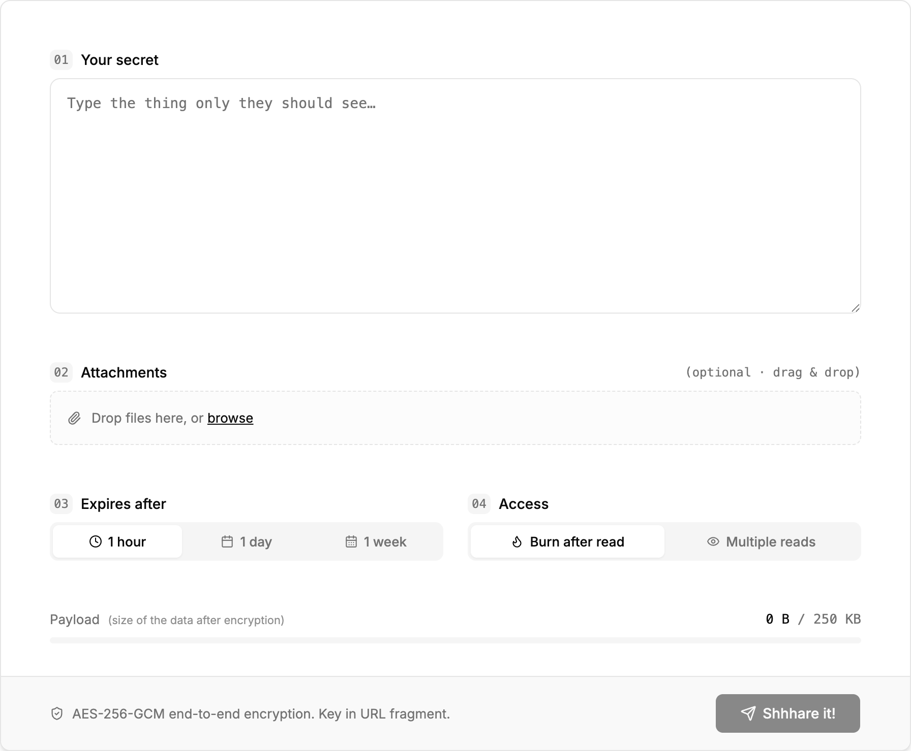
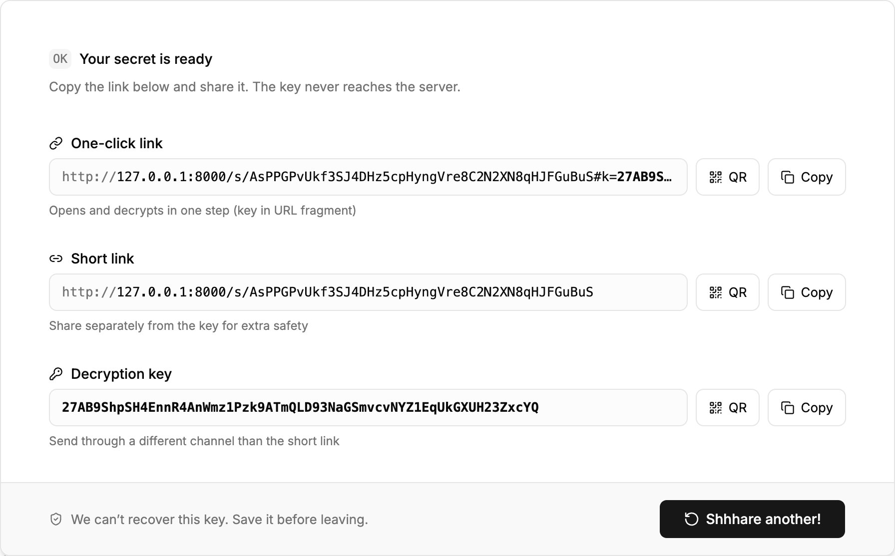
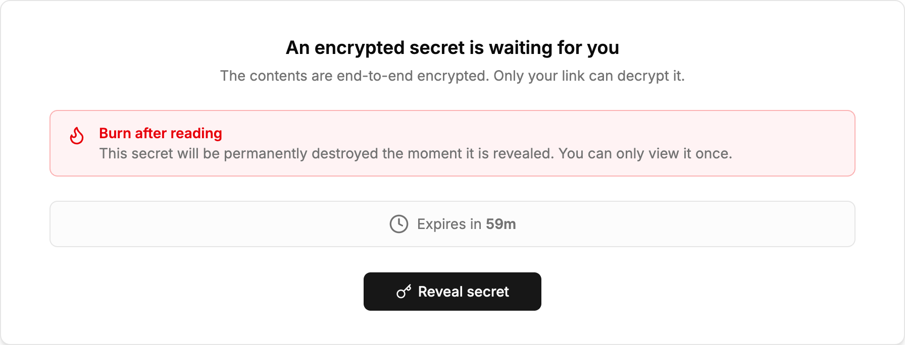

# Shhhare!

> Share secrets, not regrets.

**Shhhare!** is a self-hostable, end-to-end encrypted, one-time-secret service. Paste a password, API key, or any sensitive snippet, and get back a single short link to share. The recipient opens it, reads the secret, and it's gone.

The server never sees your plaintext. Encryption and decryption happen entirely in the browser using the Web Crypto API, inside dedicated Web Workers. Only the ciphertext is stored in Redis, behind a randomly generated identifier — and the symmetric key only ever lives in the URL fragment, which browsers do not send to the server.

---

## Highlights

- **Zero-knowledge by design** — AES-GCM 256-bit encryption in the browser; the key is encoded into the URL fragment (`#…`) and never reaches the backend.
- **Burn-after-reading** — optional one-time access; the ciphertext is deleted from Redis on first successful read.
- **TTL-based expiry** — secrets auto-expire after 1 hour, 1 day, or 1 week (Redis `EXPIRE`).
- **Fast, tiny, single-binary backend** — async Rust on top of [Poem](https://github.com/poem-web/poem) + Redis, with the SPA and docs embedded into the binary via `rust-embed`.
- **OpenAPI out of the box** — `poem-openapi` produces a live schema served at `/doc/schema.json`, with a [Scalar](https://github.com/scalar/scalar) reference UI at `/doc/`.
- **Modern frontend** — React 19 + TanStack Router + Tailwind v4 + shadcn/ui, with QR-code sharing via `react-qr-code`.
- **Containerized** — multi-stage Dockerfile produces a small `debian:stable-slim` image with a single static-ish binary.

---

## Screenshots

### 1. Compose a secret

Type the payload, optionally attach files, pick an expiry (1 hour / 1 day / 1 week) and an access mode (burn-after-read or multiple reads). The live payload meter shows the encrypted size against the configured `MAX_SIZE`.



### 2. Share the link

After encryption, you get a one-click link (with the key in the URL fragment), a short link (without the key — share it through a separate channel), and the raw decryption key. Each has a Copy button and a QR code for easy hand-off.



### 3. Reveal on the other side

The recipient sees a clear warning when the secret is set to burn after reading, plus the remaining TTL. Decryption only happens after they explicitly click **Reveal secret**.



---

## Architecture

```
┌────────────────────┐        ┌──────────────────────────┐        ┌────────────┐
│  Browser (React)   │        │  shhhare (Rust / Poem)   │        │  Redis     │
│                    │        │                          │        │            │
│  ┌──────────────┐  │ HTTPS  │  /            (SPA)      │        │            │
│  │ encrypt.ts   │──┼───────▶│  /doc/        (Scalar)   │───────▶│            │
│  │ (Web Worker) │  │ cipher │  /static/...  (assets)   │ cipher │            │
│  └──────────────┘  │  only  │  /api/health             │  only  │  KV + TTL  │
│  ┌──────────────┐  │        │  /api/secret  POST/GET   │        │            │
│  │ decrypt.ts   │◀─┼────────│                          │◀───────│            │
│  │ (Web Worker) │  │        |                          |        |            |
│  └──────────────┘  │        │                          │        │            │
└────────────────────┘        └──────────────────────────┘        └────────────┘
        ▲
        │ key lives only in URL fragment (#...) — never sent to the server
```

### Crypto flow

1. The browser generates a random 256-bit AES-GCM key and a 12-byte IV, then encrypts the plaintext.
2. The ciphertext (Base64) is `POST`ed to `/api/secret`, together with a TTL and a `bar` ("burn-after-read") flag.
3. The server stores `"<bar>|<ciphertext>"` in Redis under a random Base58-encoded 32-byte key, with an `EXPIRE` TTL and `NX` to avoid collisions.
4. The server returns the storage `key`. The browser builds a share link of the form:

   ```
   https://your-host/s/<storage-key>#<base58(rawKey || iv)>
   ```

5. On open, the recipient's browser fetches the ciphertext from `/api/secret/:key`, decrypts with the key from the fragment, and — if `bar` is set — the server deletes the entry on first read.

### Repository layout

```
shhhare/        Rust backend (Poem + poem-openapi + Redis)
shhhare_app/    React 19 SPA (TanStack Router, Tailwind v4, shadcn/ui)
shhhare_doc/    Vue 3 app embedding Scalar API reference for /doc/
Dockerfile      Multi-stage build: Node (frontends) → Rust (backend) → Debian
```

The two frontends are built first, their `dist/` outputs are copied into `shhhare/files/`, and `rust-embed` bakes them into the final binary so the backend ships as a single executable.

---

## Quick start

### With Docker

```sh
docker build -t shhhare .
docker run --rm -p 8000:8000 \
    -e HOST=0.0.0.0 \
    -e REDIS_URL=redis://host.docker.internal:6379 \
    shhhare
```

Then open <http://localhost:8000>.

### Local development

You'll need:

- [Rust](https://rustup.rs/) 1.95+ (edition 2024)
- Node.js 24 (a `volta` pin is included)
- A running Redis instance (e.g. `docker run -p 6379:6379 redis:7`)

Build the frontends so the backend can embed them:

```sh
# SPA
cd shhhare_app && npm install && npm run build && cd -

# API reference UI
cd shhhare_doc && npm install && npm run build && cd -
```

Run the backend:

```sh
cd shhhare
REDIS_URL=redis://127.0.0.1:6379 cargo run --release
```

Server output:

```
[ 📦 ] Connecting to Redis...
[ 🚀 ] Listening on http://127.0.0.1:8000
```

For frontend hot-reload, run the Vite dev server in `shhhare_app` (`npm run dev`) alongside the backend and proxy `/api` to it as needed.

---

## Configuration

The backend is configured through CLI flags or matching environment variables (via `clap` + `dotenvy`). A `.env` file in the working directory is loaded automatically.

| Flag           | Env var       | Default     | Description                                                                 |
| -------------- | ------------- | ----------- | --------------------------------------------------------------------------- |
| `--host`       | `HOST`        | `127.0.0.1` | Bind address.                                                               |
| `--port`       | `PORT`        | `8000`      | Bind port.                                                                  |
| `--redis-url`  | `REDIS_URL`   | _required_  | Redis connection URL, e.g. `redis://127.0.0.1:6379`.                        |
| `--max-size`   | `MAX_SIZE`    | `256KB`     | Maximum ciphertext size. `KB/MB/GB` are decimal; `KiB/MiB/GiB` are binary.  |

---

## HTTP API

The full schema is available at `GET /doc/schema.json` and rendered at `GET /doc/`.

### `POST /api/secret`

Store an encrypted secret.

```json
{
  "val": "<base64 ciphertext>",
  "ttl": "H",   // "H" = 1 hour, "D" = 1 day, "W" = 1 week
  "bar": true   // burn-after-read
}
```

Responses:

- `200 OK` → `{ "key": "<base58 storage key>" }`
- `400 Bad Request` — payload exceeds `--max-size`
- `409 Conflict` — extremely rare key collision
- `500 Internal Server Error`

### `GET /api/secret/:key`

Peek at metadata without consuming the secret.

- `200 OK` → `{ "ttl": <seconds>, "bar": <bool> }`
- `404 Not Found`

### `POST /api/secret/:key`

Read (and, if `bar=true`, atomically delete) the secret.

- `200 OK` → `{ "val": "<base64 ciphertext>", "ttl": <seconds> }`
- `404 Not Found`

### `GET /api/health`

Pings Redis. Returns `200 OK` when healthy, `503 Service Unavailable` otherwise.

---

## Security notes

- **The encryption key never touches the server.** It is generated client-side and only ever appears in the URL fragment, which browsers do not include in HTTP requests.
- **Storage IDs are unguessable.** 32 random bytes (`getrandom`) Base58-encoded, stored with `SET … NX EX <ttl>`.
- **Run behind TLS in production.** A fragment is only as private as the transport. Terminate HTTPS at a reverse proxy (Caddy, nginx, Traefik, …) in front of `shhhare`.
- **Redis is the trust boundary for availability.** It only ever sees ciphertext, but anyone with access to it can delete or expire entries.
- **`MAX_SIZE` caps DoS surface** for oversized payloads — tune it for your deployment.

---
